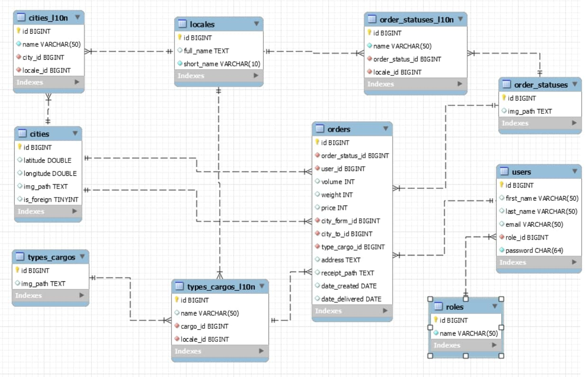

---
Для того щоб запустити проект потрібно виконати команду "mvn tomcat7:run"

# :musical_note: Доставка вантажу

Існують ролі: Користувач, Авторизований користувач, Менеджер.
На сайті компанії доставки вантажів розміщено інформацію про напрямки доставки, а також про тарифи (тарифи залежать від відстані, ваги та габаритів вантажу).
Незареєстрований користувач може переглядати інформацію на сайті, відсортувавши чи відфільтрувавши її за напрямами доставки, а також має можливість самостійно розрахувати вартість послуг.
Авторизований користувач може створити заявку на доставку вантажу і вказати адресу доставки. Заявка містить інформацію про тип багажу, вагу, об’єм і дату отримання.
Менеджер опрацьовує заявки і формує квитанції до сплати, а також може отримувати звіти щодо доставок (по днях та напрямках).
Авторизований користувач в своєму кабінеті може сплатити квитанцію на доставку.
---
База данних:

# :notes: Завдання фінального проекту 
 
Розробити веб-застосунок, що підтримує функціональність відповідно до варіанту завдання.

## :heart: Вимоги до реалізації

1. На основі сутностей предметної області створити класи, які їм відповідають.

2. Класи і методи повинні мати назви, що відображають їх функціональність, і повинні бути рознесені по пакетам.

3. Оформлення коду має відповідати [Java Code Convention](https://www.oracle.com/technetwork/java/codeconventions-150003.pdf) ([CC for the JSP](https://www.oracle.com/technical-resources/articles/javase/code-convention.html), [Servlets and JSP Best Practices](https://www.oracle.com/technical-resources/articles/javase/servlets-jsp.html)).

4. Інформацію щодо предметної області зберігати у реляційній базі даних (в якості СУБД рекомендується використовувати [MySQL](https://www.mysql.com/) або [PostgreSQL](https://www.postgresql.org/)).

5. Для доступу до даних використовувати *JDBC API* із застосуванням готового або ж розробленого самостійно пулу з'єднань.

> НЕ допускається використання *ORM* фреймворків.

6. Застосунок має підтримувати роботу з кирилицею (бути багатомовним), в тому числі при зберіганні інформації в базі даних:
   - повинна бути можливість перемикання мови інтерфейсу;
   - повинна бути підтримка введення, виведення і зберігання інформації (в базі даних), записаної на різних мовах;
   - в якості мов обрати мінімум дві: одна на основі кирилиці (українська або російська), інша на основі латиниці (англійська).

7. Архітектура застосунка повинна відповідати шаблону [MVC](https://en.wikipedia.org/wiki/JSP_model_2_architecture).

> НЕ допускається використання *MVC*-фреймворків.

8. При реалізації бізнес-логіки необхідно використовувати шаблони проектування: Команда, Стратегія, Фабрика, Будівельник, Сінглтон, Фронт-контролер, Спостерігач, Адаптер та ін.

> Використання шаблонів повинно бути обґрунтованим.

9. Використовуючи сервлети і *JSP*, реалізувати функціональність, наведену в постановці завдання.

10. Використовувати [Apache Tomcat](http://tomcat.apache.org/) у якості контейнера сервлетів.

11. На сторінках *JSP* застосовувати теги з бібліотеки [JSTL](http://tomcat.apache.org/taglibs.html) та розроблені власні теги (мінімум: один тег *custom tag library* і один тег *tag file*).

12. Реалізувати захист від повторної відправки даних на сервер при оновленні сторінки (реалізувати [PRG](https://en.wikipedia.org/wiki/Post/Redirect/Get)).

13. При розробці використовувати сесії, фільтри, слухачі.

14. У застосунку повинні бути реалізовані аутентифікація і авторизація, розмежування прав доступу користувачів системи до компонентів програми. Шифрування паролів заохочується.

15. Впровадити у проект журнал подій із використанням бібліотеки [log4j](https://logging.apache.org/log4j/2.x/index.html).

16. Код повинен містити коментарі документації (всі класи верхнього рівня, нетривіальні методи і конструктори).

17. Застосунок має бути покритим модульними тестами (мінімальний відсоток покриття - **40%**). Написання інтеграційних тестів заохочуються.

18. Реалізувати механізм пагінації сторінок з даними.

19. Всі поля введення повинні бути із валідацією даних.

20. Застосунок має коректно реагувати на помилки та виключні ситуації різного роду (кінцевий користувач не повинен бачити *stack trace* на стороні клієнта).

21. Самостійне розширення постановки задачі по функціональності заохочується (додавання капчі, формування звітів у різних форматах, тощо)!

22. Використання *HTML, CSS, JS* фреймворків для інтерфейсу користувача ([Bootstrap](https://getbootstrap.com/), [Materialize](https://materializecss.com/) та ін.) заохочується!
 
> За три дні до моменту старту захистів проектів (інтерв’ю) необхідно підготувати у вигляді окремого файлу схему бази даних, а також надати посилання на репозиторій із проектом.

## :green_heart: Етапи розробки

1. Виконати аналіз завдання, вивчити прикладну область, обміркувати роботу системи загалом.

2. Описати функціонал системи для послідовної (поступової) реалізації.
   - Базовий функціонал, який реалізується в першу чергу.
   - Необхідний функціонал, який реалізується на наступному етапі.
   - Додатковий функціонал, який бажано реалізувати для підвищення зручності використання, рівня безпеки, продуктивності та ін.
   - Розширений функцінал, реалізація якого може бути корисна.

3. Описати декілька сценаріїв використання відповідно до визначених ролей користувача.

4. Розробити БД.
   - Виконати проектування (концептуальне, логічне, фізичне).
   - Заповнити даними для тестування.
   - Перевірити на відповідність функціоналу, визначеному в п.2.

5. Розробити базовий інтерфейс користувача *(HTML, JSP)* з урахуванням сценаріїв п.3.

6. Створити прототип.
   - Реалізувати систему з базовим функціоналом.
   - Перевірити працездатність та усунути помилки.
   - Визначити функціонал для подальшого поліпшення прототипу.

7. Послідовно поліпшувати прототип до досягнення запланованої функціональності.

